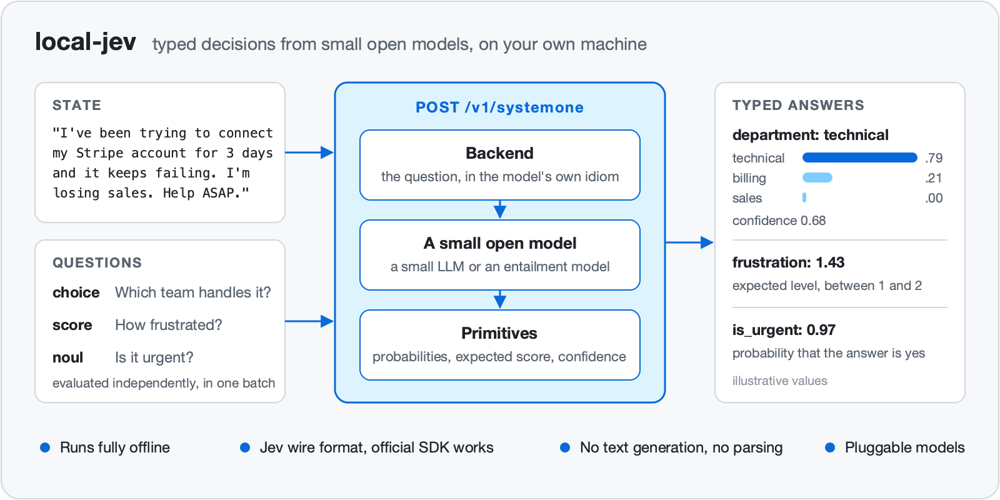
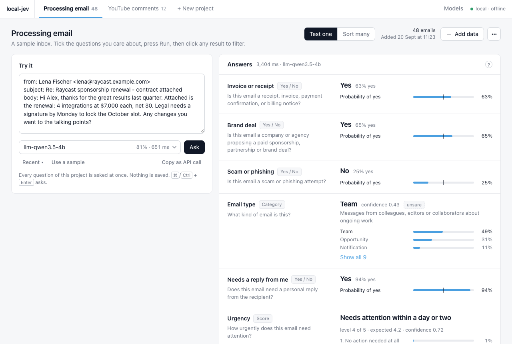
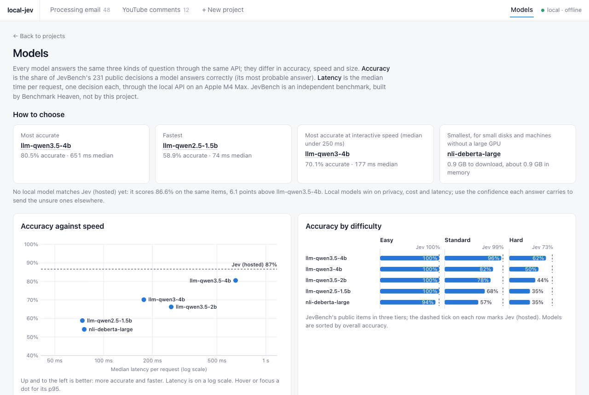
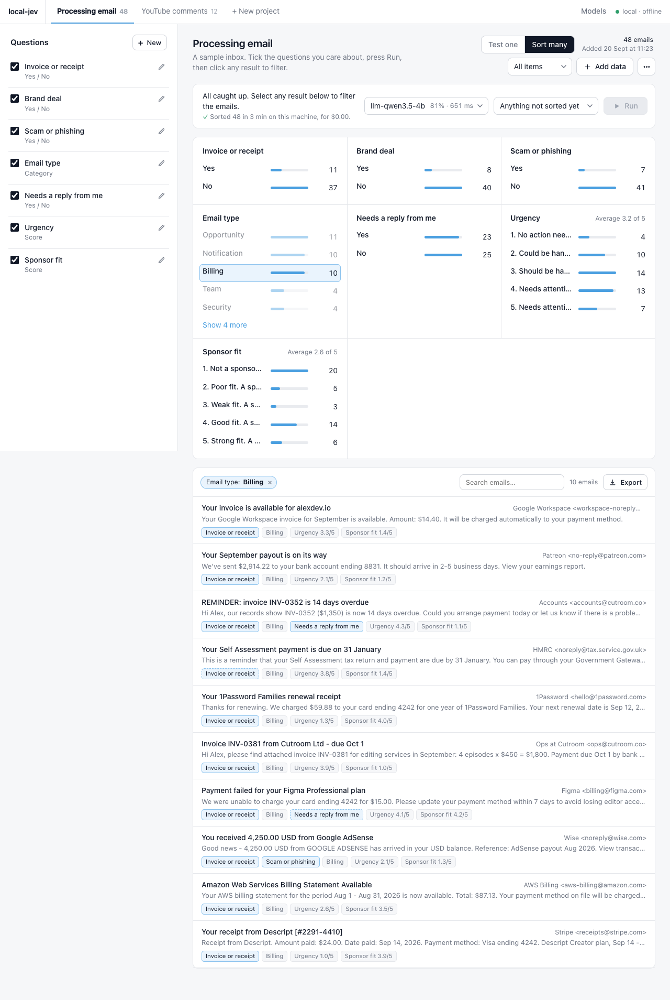
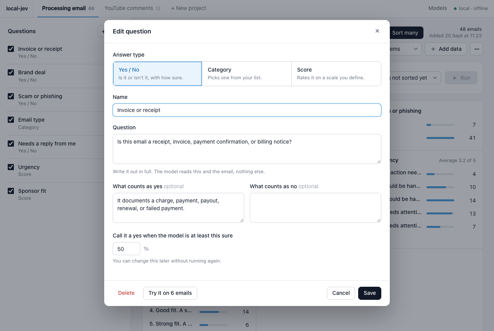

# local-jev

A local, offline System One server. Software that needs a decision rather than prose (which queue, how severe, is this spam) sends a piece of text and some typed questions, and gets back a choice, a score or a yes/no, each with a probability for every possible answer. local-jev speaks exactly the wire format of TypeSafe's hosted Jev API, so the official SDK and existing client code work unchanged, but the models run on your own machine: small open models, a Qwen instruction-tuned model by default and an entailment model as the lightweight option. Nothing leaves the machine.



**Status**

- On [JevBench](https://github.com/fstandhartinger/jevbench)'s 231 public items the default model answers **80.5%** correctly, against 86.6% published for the hosted Jev API and 81.0% for SemIf; the gap is on the hard tier. [All results](docs/results.md).
- Local, offline after the first model download, and wire-compatible with Jev's `/v1/systemone` (checked with the unmodified official `typesafe-sdk`). An optional browser portal comes with it.
- A research project, not a finished product. The licence has not been chosen yet ([below](#licence)).

## Quick start

**Requirements**

- Python 3.10 or newer, and [uv](https://docs.astral.sh/uv/) (or plain `pip`).
- macOS on Apple Silicon, Linux, or Windows through WSL2. A CUDA GPU or an Apple GPU is recommended; the CPU works, slowly. All published numbers come from an Apple M4 Max.
- Disk and memory for the models you use: 0.87 GB for the smallest (`nli-deberta-large`), 9.32 GB on disk and about 8.5 GB of memory for the default (`llm-qwen3.5-4b`).

**Install**

```sh
git clone <this repo> local-jev && cd local-jev
uv venv --python 3.12 .venv
uv pip install --python .venv/bin/python -e .          # add ".[dev]" for the tests and the training tools
```

(With `pip`: `python -m venv .venv && .venv/bin/pip install -e .`)

**Run the server**

```sh
.venv/bin/local-jev serve            # the Jev-compatible API only
.venv/bin/local-jev serve --ui       # the API plus the browser portal
```

Both listen on `http://127.0.0.1:8765` and print what they serve:

```
  model     nli-deberta-large   [nli]   (local-jev models lists the rest)
  fetching  its weights from Hugging Face; this happens once
  loaded    ... (including warm-up)
  api       http://127.0.0.1:8765/v1/systemone   (interactive docs: http://127.0.0.1:8765/docs)
  ui        off (add --ui for the browser portal)
  sdk       export TYPESAFE_BASE_URL=http://127.0.0.1:8765 TYPESAFE_API_KEY=local
```

Without `--ui` the server exposes only `POST /v1/systemone`, `GET /v1/models`, `GET /healthz` and the interactive API docs at `/docs`; `GET /` returns a short JSON pointer to them, and no project database is created. `--ui` adds the portal at `/` and the `/api/*` endpoints it uses.

**What the first start downloads.** If no model is on disk yet, the server fetches the smallest one, `nli-deberta-large` (0.87 GB), and says so. It never starts a large download by itself. To use the most accurate model, ask for it once; the 9.32 GB download happens on that start, and from then on it is the default:

```sh
.venv/bin/local-jev serve --model llm-qwen3.5-4b
```

| Option | Default | Meaning |
|---|---|---|
| `--model NAME` | the best model already on disk | the server's default model; any name from `local-jev models`. Requests can still pick another. |
| `--ui` | off | also serve the browser portal |
| `--open` | off | open a browser: the portal with `--ui`, otherwise `/docs` |
| `--host`, `--port` | `127.0.0.1`, `8765` | where to listen |
| `--db PATH` | | the projects database (with `--ui`) |
| `--no-warmup` | off | skip answering three throwaway questions when each model loads (warm-up makes the first real request faster) |

## How to use

### The API

One endpoint does the work: `POST /v1/systemone` takes one **state** (the text to judge: a string, a JSON object or an array) and any number of named **questions**.

```sh
curl -s http://127.0.0.1:8765/v1/systemone \
  -H "Content-Type: application/json" \
  -d '{
    "state": "You charged my card twice this month. Fix it.",
    "model": "jev-latest",
    "questions": {
      "refund":   {"type": "noul",   "instructions": "The customer is asking for money back"},
      "team":     {"type": "choice", "instructions": "Which team should handle this",
                   "criteria": {"billing": "Charges and refunds", "technical": "Bugs", "sales": "Pricing"}},
      "severity": {"type": "score",  "instructions": "How serious is the problem",
                   "criteria": ["Minor annoyance", "Real problem with a workaround", "Blocking"]}
    }
  }'
```

```json
{
  "model": "llm-qwen3.5-4b",
  "answers": {
    "refund":   {"type": "noul", "noul": 0.91},
    "team":     {"type": "choice", "choice": "billing", "confidence": 0.88,
                 "probabilities": {"billing": 0.92, "technical": 0.05, "sales": 0.03}},
    "severity": {"type": "score", "score": 1.2, "confidence": 0.55,
                 "legend": {"0": "Minor annoyance", "1": "Real problem with a workaround", "2": "Blocking"},
                 "probabilities": {"0": 0.1, "1": 0.6, "2": 0.3}}
  },
  "usage": {"input_tokens": 612, "output_tokens": 3}
}
```

The shape is exactly Jev's; the values are illustrative. Questions in one request are evaluated independently: none can see another's answer. `model` in the response names the model that actually answered.

`scripts/example.sh` sends that same request (one prompt, three questions) and prints the answer; pass your own prompt as its argument: `scripts/example.sh "My order arrived broken."` `scripts/example-model.sh` does the same after asking which model should answer. Both say so if the server is not running.

To check a running server end to end, `scripts/test-api.sh` sends the requests above and a few malformed ones with `curl` and checks each answer: the status codes, the shape of every answer type, probabilities that sum to 1, and two plain-sense verdicts. It needs `curl` and `python3` and exits non-zero if a check fails.

```sh
scripts/test-api.sh                               # http://127.0.0.1:8765, the server's default model
scripts/test-api.sh http://192.168.1.20:8765      # another server
MODEL=nli-deberta-large scripts/test-api.sh       # a specific model
LONG=1 scripts/test-api.sh                        # also a state longer than the model's window (slow on the LLMs)
```

If the server was started with `LOCAL_JEV_API_KEY`, export the same variable before running the script.

- **Choosing the model per request.** The `model` field takes any name from `GET /v1/models` (or `local-jev models`). `jev-latest`, `jev-preview` and `local-jev-latest` all mean the server's default, so clients written for Jev need no change. One server can answer with several models; it keeps a bounded number loaded (see [Choosing a model](#choosing-a-model)).
- **Long states are shortened, not refused.** If the state does not fit the model's window, the start and the end are kept and the response carries the header `x-local-jev-truncated: true`. The body keeps Jev's shape.
- **Errors.** `422` for an invalid request, with `{"detail": [{"loc": [...], "msg": ..., "type": ...}]}` pointing inside the offending question; `404` for an unknown model; `503` with `type: "model_unavailable"` and the reason when a known model cannot be loaded. Every response carries an `x-typesafe-request-id` header.
- **An API key, if you want one.** By default there is none. Start the server with `LOCAL_JEV_API_KEY=<secret>` in its environment and every `/v1/*` request must send `Authorization: Bearer <secret>`, or it gets `401`. The key protects `/v1/*` only, not the portal's `/api/*` or `/docs`, so keep the server on `127.0.0.1` or behind your own proxy if others can reach the machine.

### The official SDK, unchanged

The `typesafe-sdk` package reads its base URL from the environment:

```sh
export TYPESAFE_BASE_URL=http://127.0.0.1:8765
export TYPESAFE_API_KEY=local        # the SDK requires a value; local-jev ignores it unless LOCAL_JEV_API_KEY is set
```

```python
from typesafe_sdk import Choice, Noul, Score, TypeSafeClient

client = TypeSafeClient()
result = client.system_one(
    state="I've been trying to connect my Stripe account for 3 days. I'm losing sales. Help ASAP.",
    questions={
        "department": Choice(instructions="Which team should handle this",
                             criteria={"billing": "Payment or subscription issues",
                                       "technical": "Bugs or integration problems",
                                       "sales": "Pricing or account questions"}),
        "frustration": Score(instructions="How frustrated the customer appears",
                             criteria=["Calm", "Frustrated but civil", "Very angry"]),
        "is_urgent": Noul(instructions="The message conveys urgency"),
    },
)
```

### The three primitives

| Primitive | Question | Answer |
|---|---|---|
| **Choice** | `criteria` is a map of option name to description (up to 255 options). | `choice`, `probabilities` over every option, `confidence`. |
| **Score** | `criteria` is an ordered list of level descriptions (up to 10). | `score` is the probability-weighted average level, so it can land between levels; plus `legend`, `probabilities`, `confidence`. |
| **Noul** | A yes/no statement, with optional `criteria.true` / `criteria.false`. | `noul`, the probability that the answer is yes. No separate confidence: the probability is the confidence. |

`instructions` and every criteria value accept a string, an object, or an array, as in Jev's API.

**Give options meaningful names.** The models read each option's name and description as text. `"refund_request": "The customer wants money back"` does much better than a bare code such as `cat_7`.

`confidence` is `(n * p_max - 1) / (n - 1)`: 1.0 when all the probability is on one option, 0.0 when it is spread evenly. Route on it: act when it is high, ask a human or a bigger model when it is low. Thresholds differ per model and per primitive, so tune them on your own data.

## The UI

`local-jev serve --ui` adds a browser UI to the API. Each project opens in the **Test one** view: paste or type a single item on the left, press Ask, and every question of the project is answered on the right. The answers come back as one list in the project's order: each row shows the question, the verdict and the probabilities behind it. Nothing is saved; it is the quickest way to see what a model makes of your questions before you run them over a pile of data. Recent prompts are one click away, and **Copy as API call** turns the current text and questions into the equivalent `curl` command or `typesafe-sdk` Python for `POST /v1/systemone`.



To pick a model, open **Models** in the top bar (or "Compare models" in the model picker). The page compares every installed model on the same independent benchmark: accuracy against speed, accuracy by difficulty, size, and plain guidance on when to use each. "Use this model" makes it the one both views run.



The **Sort many** view, one click away, is for the pile:

1. Create a **project** and import items (paste, CSV, JSON/JSONL, text, `.eml`/`.mbox`).
2. Add **questions**: yes/no, category, or score, each with a name, the question itself, and optional criteria.
3. **Run** the questions over the items, with the model of your choice. Progress is shown as it goes.
4. Read the **results**: one card per question with counts per answer. Click an answer to filter the items.
5. **Export** items and answers as CSV.



*Sort many on the sample email project with the default model, `llm-qwen3.5-4b`, filtered by clicking "Billing" under Email type: all ten emails it returns are billing mail. One error is visible: a Google AdSense payout notice is also flagged "Scam or phishing".*



Yes/no thresholds are applied at display time, so you can move a threshold from 50% to 90% without running anything again. Answers are kept per model, so the same project can be run under two models and compared. A sample project, *Processing email*, is seeded on first start.

## Choosing a model

A **model card** names a model and the **backend** that runs it. The built-in models, with their results on JevBench's 231 public items ([details](docs/results.md)):

| Model | Backend | JevBench | Median per request | Download | Choose it when |
|---|---|---|---|---|---|
| `llm-qwen3.5-4b` | llm | **80.5%** | 651 ms | 9.32 GB | accuracy matters most: policy checks, multi-step judgments, long documents |
| `llm-qwen3-4b` | llm | **70.1%** | 177 ms | 8.04 GB | you want interactive speed with solid accuracy |
| `llm-qwen3.5-2b` | llm | **66.2%** | 261 ms | 4.55 GB | you have 4-6 GB of memory to spare |
| `llm-qwen2.5-1.5b` | llm | **58.9%** | 74 ms | 3.09 GB | speed and little memory, straightforward questions |
| `nli-deberta-large` | nli | **54.1%** | 76 ms | 0.87 GB | clear-cut classification, bulk jobs, the first run on a new machine |

Latencies are from an Apple M4 Max. `llm-qwen3.5-4b` is slow for its size on a Mac because PyTorch has no fast path on Apple GPUs for its linear-attention layers.

```sh
.venv/bin/local-jev models
```

```
  name                   backend   priority  status
  llm-qwen3.5-4b         llm             95  ready   <- default
  llm-qwen3-4b           llm             80  ready (weights download on first use)
  llm-qwen3.5-2b         llm             70  ready (weights download on first use)
  llm-qwen2.5-1.5b       llm             60  ready (weights download on first use)
  nli-deberta-large      nli             50  ready

  nli       An entailment cross-encoder (e.g. DeBERTa-v3 zero-shot): each answer becomes a hypothesis.
  llm       A small instruction-tuned language model read at the answer token (e.g. Qwen 1.5-4B).
  ensemble  Several registry models pooled (weighted geometric mean of their calibrated probabilities). Costs the sum of their latencies.
```

*(Illustrative: a machine that has fetched the default and the entailment model.)*

**The default** is the highest-priority model whose weights are already on disk; on a fresh machine, `nli-deberta-large`. **Four ways to switch:**

| | |
|---|---|
| `local-jev serve --model llm-qwen3-4b` | the server's default |
| `LOCAL_JEV_MODEL=llm-qwen3-4b local-jev serve` | the same, from the environment |
| `"model": "llm-qwen2.5-1.5b"` in a request | that request only |
| the model picker in the portal (`--ui`) | that run; the **Models page** (`/#models`) compares the models on accuracy, speed and size |

**Memory.** The server loads models on demand. Before loading one it unloads the least recently used until the new model fits a memory budget: `LOCAL_JEV_MEMORY_GB`, or half the machine's RAM (18 GB on a 36 GB Mac: two 4B models, or one plus small ones). A single model is always allowed, even if it exceeds the budget.

**Your own model.** Drop a card into `models/cards/`, then calibrate it and measure it:

```json
{"name": "my-llm", "backend": "llm", "hf_model": "<org>/<an instruct model>", "prompt": "json",
 "license": "<its licence>", "context_tokens": 32768, "priority": 65}
```

The `llm` backend lays a question out as plain text or as one JSON object, and the card's `"prompt"` chooses. It matters: Qwen3.5-4B scores 73.2% plain and 80.5% JSON, while Qwen3-4B does better plain. Measure both. See [docs/training.md](docs/training.md#independent-benchmark) for calibrating and benchmarking, and [docs/architecture.md](docs/architecture.md#6-the-engine-and-the-model-registry) for every card field.

## How it compares

[JevBench](https://github.com/fstandhartinger/jevbench) (Benchmark Heaven, MIT) is the number to lead with: an independent benchmark whose harness speaks Jev's API, run through local-jev's own `/v1/systemone` on its 231 public items.

| System | JevBench public | Easy / Standard / Hard |
|---|---|---|
| Jev 1.13.0, hosted (published) | **86.6%** | 48/48, 71/72, 81/111 |
| SemIf, Qwen3.5-4B (published) | **81.0%** | 48/48, 71/72, 68/111 |
| `llm-qwen3.5-4b` | **80.5%** | 48/48, 69/72, 69/111 |
| `llm-qwen3-4b` | **70.1%** | 48/48, 59/72, 55/111 |
| `nli-deberta-large` | **54.1%** | 45/48, 41/72, 39/111 |

**Our own test set was too easy.** Before JevBench, local-jev was measured on 100 cases written for the project. The entailment model scored 95% there and 54.1% on JevBench; a pooled ensemble scored 98% there and 68.8% on JevBench, below its stronger member alone, so its built-in card was removed. The 100 cases remain a quick regression check:

<!-- COMPARISON:BEGIN -->
| System | 100 hand-written cases | Says it is sure | Accuracy when sure | Median latency |
|---|---|---|---|---|
| Jev (hosted) | 100% | 100% | 100% | 842 ms |
| `llm-qwen3.5-4b` | 100% | 93% | 100% | 478 ms |
| `llm-qwen3-4b` | 96% | 94% | 98% | 162 ms |
| `nli-deberta-large` | 95% | 46% | 100% | 46 ms |
| `llm-qwen3.5-2b` | 91% | 68% | 99% | 200 ms |
| `llm-qwen2.5-1.5b` | 87% | 62% | 98% | 68 ms |

"Sure" means a confidence of at least 0.8. When a local model says it is sure it is right 98% to 100% of the time, so confidence is usable for routing.
<!-- COMPARISON:END -->

Full tables by tier and question type, latencies, the prompt-layout experiment, performance figures, reproduction commands and caveats (public items only; Jev's JevBench row is its published result; the prompt layouts were chosen on the same items) are in **[docs/results.md](docs/results.md)**. To compare systems yourself:

```sh
.venv/bin/local-jev serve &
.venv/bin/python evals/compare/run_compare.py --systems llm-qwen3.5-4b llm-qwen3-4b nli-deberta-large
```

Add `jev` to `--systems` to include the hosted API with your own key (`TYPESAFE_API_KEY`); leave it out and nothing leaves the machine.

## How it works

No model in local-jev ever generates text. Each is asked the question in the form it was trained to answer, and the probabilities are read straight off its output layer.

- The **`llm` backend** (the default model) puts the state first, then the question and its options as a lettered list, in a plain or JSON layout chosen per card, and reads the next-token probabilities of `A`, `B`, `C` instead of letting the model reply: one forward pass, no sampling, deterministic. All questions about one state share its reading, so a second question about the same document costs far less than the first.
- The **`nli` backend** turns every possible answer into a sentence and asks an entailment model whether the state entails it.
- An **`ensemble` backend** can pool several models' calibrated probabilities. No built-in model uses it.
- Around the models, everything is shared: questions are validated once, a per-model temperature makes stated confidence mean what it says, long states are shortened, all model work runs under one lock so concurrent requests are safe on Apple GPUs, and the answer maths returns Jev-shaped choices, scores and yes/nos.

| Document | |
|---|---|
| [docs/architecture.md](docs/architecture.md) | How a request becomes an answer: backends, prompt layouts, shared-prefix scoring, calibration, model cards, the API, the portal, limits. |
| [docs/results.md](docs/results.md) | Every measured number, how to reproduce it, and its caveats. |
| [docs/training.md](docs/training.md) | The data pipeline, fine-tuning the entailment model, calibration, evaluation, and running JevBench. |
| [docs/history.md](docs/history.md) | How the project got here, including the much smaller model it started on. |
| [docs/related-work.md](docs/related-work.md) | Other open projects rebuilding the System One pattern. |
| [docs/jev.md](docs/jev.md) | Reference notes on Jev, from TypeSafe's public documentation. |
| [training/README-gpu.md](training/README-gpu.md) | Fine-tuning on an NVIDIA GPU. |
| [CONTRIBUTING.md](CONTRIBUTING.md) | Development conventions and what makes a useful contribution. |

## Repository layout

```
local-jev/
├── README.md, CONTRIBUTING.md, pyproject.toml, .gitignore
├── src/local_jev/
│   ├── __init__.py
│   ├── cli.py           `local-jev serve [--ui]`, `local-jev models`
│   ├── api.py           FastAPI app: the /v1 API; with --ui, the portal and /api/*
│   ├── schema.py        the Jev wire format as pydantic models
│   ├── questions.py     the backend-neutral Question; validation happens once, here
│   ├── engine.py        loading within a memory budget, calibration, answer assembly
│   ├── models.py        model cards: discovery, availability, default selection
│   ├── primitives.py    choice / score / noul maths, confidence
│   ├── backends/
│   │   ├── __init__.py  the Backend interface, Item, Scored, DEVICE_LOCK, load_backend()
│   │   ├── llm.py       lettered options, prompt layouts, shared-prefix scoring
│   │   ├── nli.py       answers as entailment hypotheses
│   │   ├── ensemble.py  pools other models' calibrated probabilities
│   │   └── _hf.py       shared PyTorch / transformers helpers
│   ├── cards/           five built-in model cards (JSON): calibration, JevBench results, size, guidance
│   ├── projects.py      the portal's API: runs, results, filtering, export
│   ├── store.py         SQLite persistence for the portal
│   ├── importer.py      CSV / JSON / JSONL / text / .eml / .mbox -> items
│   ├── seed.py          the sample "Processing email" project
│   └── ui/              index.html, app.js, style.css: the portal, no build step
├── training/
│   ├── tasks.py         task generators over public, human-labelled datasets
│   ├── email_triage.py, comment_triage.py    two small hand-written task families
│   ├── build_data.py    writes data/train.jsonl, calib.jsonl, eval/*.jsonl
│   ├── train_nli.py     optional fine-tune of the entailment model
│   ├── calibrate.py     fits a model's temperatures into models/cards/<name>.json
│   └── README-gpu.md    fine-tuning on an NVIDIA GPU
├── evals/
│   ├── run_eval.py, metrics.py, report_md.py    accuracy and calibration on the public sets
│   ├── jevbench_cards.py    records JevBench results in the model cards
│   └── compare/         build_cases.py, cases.json, run_compare.py, report_template.html: the comparator
├── scripts/
│   ├── example.sh       one request: one prompt, three questions
│   ├── example-model.sh the same, after picking a model from a menu
│   └── test-api.sh      curl checks against a running server
├── tests/               test_primitives.py, test_backends.py, test_store.py, test_projects.py, test_sdk_dropin.py
└── docs/
    ├── architecture.md, results.md, training.md, history.md, related-work.md, jev.md
    └── assets/          diagrams (SVG sources, PNGs, build.sh) and portal screenshots
```

Not in the repository, and git-ignored: model weights (downloaded to the Hugging Face cache on first use), `models/` (your cards and fine-tuned models), `data/` (generated datasets), `evals/reports/`, and the comparator's cached responses and report.

## Development

```sh
uv pip install --python .venv/bin/python -e ".[dev]"
.venv/bin/python -m pytest                         # 36 tests; 3 more are skipped without a live server
```

The unit tests need no model weights and download nothing. The last three drive a running server through the unmodified official SDK:

```sh
.venv/bin/local-jev serve --port 8765 &
LOCAL_JEV_URL=http://127.0.0.1:8765 .venv/bin/python -m pytest      # all 39
```

Diagrams in `docs/assets/` are hand-written SVG; `docs/assets/build.sh` renders the PNGs. See [CONTRIBUTING.md](CONTRIBUTING.md) for conventions, adding a backend and adding a model card.

## Acknowledgements and independence

**The models do the work, and they are other people's.** Thanks to the Qwen team for `Qwen/Qwen3.5-4B`, `Qwen/Qwen3.5-2B`, `Qwen/Qwen3-4B-Instruct-2507` and `Qwen/Qwen2.5-1.5B-Instruct`, and to Moritz Laurer for `MoritzLaurer/deberta-v3-large-zeroshot-v2.0`. local-jev uses them exactly as published.

**[JevBench](https://github.com/fstandhartinger/jevbench)** by Benchmark Heaven (MIT) is the independent benchmark local-jev is measured on; it showed that our own test set was too easy. **[SemIf](https://github.com/TheoLeeCJ/SemIf)** (MIT) contributed two ideas local-jev uses, credited in the code: the JSON prompt layout of its Qwen3.5 cards, and reading a state once and reusing it across questions. The project started on Cactus Compute's Needle 3 before moving on ([history](docs/history.md)); other projects in the same space are in [related work](docs/related-work.md).

**Jev and the System One API** are TypeSafe's. local-jev implements the request and response format that TypeSafe documents publicly and contains no TypeSafe code. It is **not affiliated with, endorsed by, or supported by** TypeSafe, Benchmark Heaven, SemIf's author, Cactus Compute, the Qwen team or any model author.

**No Jev output is used to build anything here.** TypeSafe's Master Customer Agreement (section 2.3(b)) prohibits using the service or its output to perform model distillation, to train a model to imitate its output, or to develop a similar product. Every training label in this repository comes from a public, human-annotated dataset or from a small set of examples written for the project; Jev is never a training signal or a calibration target, and Jev's JevBench number quoted here is the benchmark's published result. The only place the hosted API can appear is the optional comparator, which, if you add `jev` with your own key, records its answers to the 100 hand-written cases for a local report; those responses are git-ignored and not published. [training/tasks.py](training/tasks.py) lists every data source.

## Licence

**Not chosen yet.** There is no `LICENSE` file, so no licence is granted for the code until the repository owner adds one.

Model weights are not part of this repository. local-jev downloads them from Hugging Face on first use, and each comes under its own licence, stated in its model card:

| Model | Licence |
|---|---|
| `Qwen/Qwen3.5-4B`, `Qwen/Qwen3.5-2B`, `Qwen/Qwen3-4B-Instruct-2507`, `Qwen/Qwen2.5-1.5B-Instruct` | Apache-2.0 |
| `MoritzLaurer/deberta-v3-large-zeroshot-v2.0` | MIT |

The public datasets used by the optional training tools carry their own licences as well.
