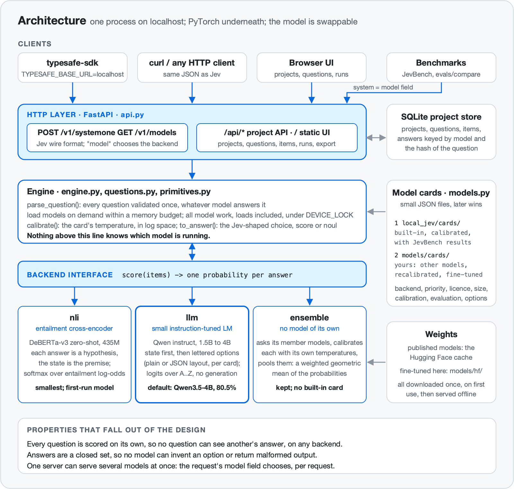
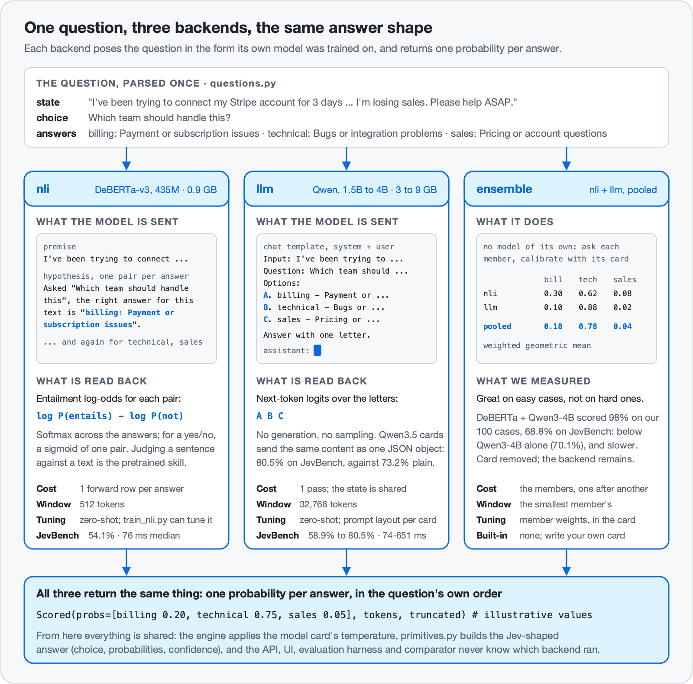

# Architecture

This document explains how local-jev turns a request into an answer, and why each part is built the way it is. For the data pipeline, fine-tuning and evaluation method, see [training.md](training.md). The project began on a different, much smaller model; that story, and why it ended, is in [history.md](history.md).



## Contents

1. [The problem being solved](#1-the-problem-being-solved)
2. [Request lifecycle](#2-request-lifecycle)
3. [Backends](#3-backends): the interface, [entailment](#the-entailment-backend), [small LLM](#the-small-llm-backend), [ensemble](#the-ensemble-backend), [adding one](#adding-a-backend), [measured side by side](#measured-side-by-side)
4. [Primitives: the maths](#4-primitives-the-maths)
5. [Calibration](#5-calibration)
6. [The engine and the model registry](#6-the-engine-and-the-model-registry)
7. [The API compatibility layer](#7-the-api-compatibility-layer)
8. [Projects and the UI](#8-projects-and-the-ui)
9. [Evaluation and benchmarks](#9-evaluation-and-benchmarks)
10. [Performance](#10-performance)
11. [Limits and known weaknesses](#11-limits-and-known-weaknesses)

## 1. The problem being solved

A System One API takes one *state* and a set of *questions* and returns, for each question, a typed answer with a probability distribution:

| Primitive | Returns |
|---|---|
| choice | the winning option, a probability for every option, a confidence |
| score | the expected level on an ordered scale, a probability for every level, a confidence |
| noul | the probability that a yes/no statement is true |

The hard requirement is the **distribution**. A model that only returns its top answer cannot tell you when it is unsure, and being able to route on uncertainty is the point of the whole approach.

local-jev gets distributions out of small open models without ever letting them generate text. Each model is asked the question in the form it was trained to answer, an entailment judgment or a multiple-choice question, and the probabilities are read straight off its output layer. The rest of this document is how.

## 2. Request lifecycle

```
POST /v1/systemone {state, model, questions}
  │
  ├─ api.py          pydantic validates the envelope
  ├─ engine.py       resolve(model): a registry name, or an alias of the default  ──► 404 if unknown
  ├─ questions.py    parse_question(): each question validated once, for every backend  ──► 422 with a precise location
  ├─ engine.py       backend(name): load on demand within a memory budget      ──► 503 if the model cannot be loaded
  ├─ backends/*      Backend.score(items): one probability per answer, under DEVICE_LOCK;
  │                  a state longer than the model's window is shortened, head and tail kept
  ├─ engine.py       calibrate(): the model card's temperature, in log space
  ├─ primitives.py   to_answer(): distribution ──► Jev-shaped answer object
  └─ engine.py       assemble {model, answers, usage}  (+ header x-local-jev-truncated: true if shortened)
```

Two properties are worth stating up front because they are consequences of the structure rather than things the code has to enforce:

- **Questions are independent.** Every (state, question) pair is an `Item` of its own, and every backend scores items separately. A question cannot see another question's answer, because nothing carries information between items. (The LLM backend reads a state once and shares that reading across the questions about it, but what is shared is the state, never an answer.)
- **Answers are always well-formed.** No model ever generates text. We only ever ask how likely each member of a closed set is, so there is no output to parse and no way to receive an option that was not offered.

## 3. Backends

`src/local_jev/backends/`, `src/local_jev/questions.py`



### The interface

Everything outside this package (validation, calibration, answer maths, the API, the UI, the project store, the evaluation harness, the comparator) needs exactly one thing from a model: *for this question and this state, how likely is each answer?* That is the whole contract:

```python
class Backend(ABC):
    kind: str                     # "nli" | "llm" | "ensemble"
    context_tokens: int

    def score(self, items: list[Item], truncate=False, max_state_tokens=None) -> list[Scored]: ...
    def warmup(self) -> float: ...            # optional
```

| Type | Fields | Meaning |
|---|---|---|
| `Item` | `question`, `state` | one parsed `Question` and the state to judge |
| `Scored` | `probs`, `tokens`, `truncated` | one probability per entry of `question.answers`, summing to 1, **before** the card's temperature is applied; input tokens read; whether the state was shortened |

`questions.py` is the other half of the contract. `parse_question()` turns a wire-format question into a frozen `Question`: `type`, `instructions`, `keys` and `descriptions` (choice and score), `legend` (the caller's level objects, returned verbatim in a score answer), `yes` and `no` (noul criteria), plus `.answers` and `.n_answers`. Validation, the 255-option and 10-level limits, and `QuestionError` with its location all live here, so every backend sees the same validated object and none of them re-implements the rules. `ContextOverflow` and `as_text` (strings pass through, structure becomes compact JSON) are defined here too.

Backends must raise `ContextOverflow` when an item does not fit and `truncate` is false, keep the head and tail of the state when it is true (`_hf.fit_text`: the first 75% and last 25% of the budget, with a `[...]` marker), and hold `self.lock`, the process-wide `DEVICE_LOCK`, around every model call ([why](#the-engine)). `load_backend(card)` imports the implementation lazily, so listing models does not import PyTorch; that happens when a model is actually loaded. `backends/_hf.py` holds what the PyTorch backends share: device choice (CUDA, then Apple MPS, then CPU), truncation, and a version-tolerant `from_pretrained`.

### The three backends

| | `nli` | `llm` | `ensemble` |
|---|---|---|---|
| Model | an entailment cross-encoder; built-in card: DeBERTa-v3-large zero-shot, 435M | an instruction-tuned causal LM; built-in cards: Qwen3.5-4B (the default), Qwen3-4B-Instruct-2507, Qwen3.5-2B, Qwen2.5-1.5B-Instruct | none of its own: other registry models |
| How a question is posed | every answer is a **hypothesis** judged against the state as premise | the state, then the question and a **lettered list** of options, in a plain or a JSON layout set per card; read the next-token logits over the letters | each member poses it its own way |
| The pretrained skill being used | deciding whether a text entails a sentence | following an instruction and answering a multiple-choice question | both |
| Cost per question | one forward row **per answer** | one pass per question over the question and options; the state is read **once** and shared by every question about it | the sum of its members |
| Context window | 512 tokens | 32,768 tokens (`context_tokens` in the card) | the smallest member's |
| Download on first use | 0.87 GB | 3.09 GB (Qwen2.5-1.5B) to 9.32 GB (Qwen3.5-4B) | its members |
| JevBench public items (231) | 54.1% | 58.9% to 80.5% | the former built-in pairing: 68.8% |
| Fine-tuned by this project | optional: `training/train_nli.py` (no tuned model has been evaluated yet) | no, used zero-shot | no |
| Calibrated by this project | yes, temperatures ship in the card | yes | pools its members' calibrated probabilities |
| Licence of the built-in models | MIT (MoritzLaurer/deberta-v3-large-zeroshot-v2.0) | Apache-2.0 (Qwen) | no built-in card |

All run on PyTorch, which is part of the base install. Weights are downloaded from Hugging Face the first time a model is used and cached; after that nothing needs the network. Measured results for every built-in model, and how they were obtained, are in [results.md](results.md).

### The entailment backend

`src/local_jev/backends/nli.py`. Built-in card: `nli-deberta-large` (MoritzLaurer's DeBERTa-v3-large zero-shot model, 435M, MIT). It is the smallest download, the model a fresh machine starts on, and the one this project can fine-tune ([training.md](training.md)). It is strong on clear-cut classification (45 of JevBench's 48 easy items) and weak on policy application and multi-step judgments (54.1% overall, 39 of 111 on the hard tier).

Natural-language-inference models read a *premise* and a *hypothesis* and say whether the first entails the second. Turning classification into entailment is the standard strong approach to zero-shot classification with small encoders, and it needs no fine-tuning to follow a new question, because judging a sentence against a text is exactly what these models were trained to do.

`hypotheses(question)` writes one declarative sentence per answer:

| Question | Hypothesis |
|---|---|
| choice, with instructions | `Asked "<instructions>", the right answer for this text is "<key>: <description>".` |
| score | the same sentence, with the level's description as the answer |
| choice or score, no instructions | `This text is best described as "<answer>".` |
| noul, instruction is a statement | the statement itself |
| noul, instruction is a question | `The answer to the question "<question>" is yes.` |
| noul with `criteria.true` | the sentence above, with the criterion appended in parentheses |

The state is the premise. Each (premise, hypothesis) pair is one row, and the model returns logits over its labels. The backend reduces them to **entailment log-odds**, `log P(entailment) - log P(everything else)`, which works for both two-way models (entailment / not_entailment) and three-way ones (entailment / neutral / contradiction).

- **Choice and score:** a softmax over the answers' log-odds.
- **Yes/no:** a sigmoid of the single pair's log-odds.

The window is 512 tokens, shared between state and hypothesis, with `truncation="only_first"` so that it is always the state that gives way. Since the API shortens long states instead of refusing them, a long document is judged on its start and end. `criteria.false` has no natural place in a single hypothesis and is not used by this backend.

### The small-LLM backend

`src/local_jev/backends/llm.py`. Built-in cards: `llm-qwen3.5-4b` (the default), `llm-qwen3-4b`, `llm-qwen3.5-2b` and `llm-qwen2.5-1.5b`, all Qwen instruction-tuned models under Apache-2.0.

An instruction-tuned language model is asked a multiple-choice question through its chat template and, instead of letting it reply, the backend reads the next-token logits over the option letters. There is no generation and no sampling, so the answer is deterministic. A yes/no is the two options `Yes` and `No`, with the criteria attached when given; a score lists `Level i of n: <text>`. The backend checks at load time that every capital letter is a single token for the model's tokenizer.

#### Two prompt layouts, chosen per card

The same content can be laid out two ways, and the card's `"prompt"` option picks one.

**`plain`** (the default):

```
system: You are a careful, literal classifier. Read the input and the question, then answer
        with the single letter of the best option and nothing else.
user:   Input:
        <the state>

        Question: Which team should handle this

        Options:
        A. billing - Payment or subscription issues
        B. technical - Bugs or integration problems
        C. sales - Pricing or account questions

        Answer with one letter.
assistant:  <- one forward pass; softmax over the next-token logits of A, B, C
```

**`json`**, the layout of [SemIf](https://github.com/TheoLeeCJ/SemIf): the user turn is one JSON object, `{"evidence": <the state>, "criterion": <the question>, "options": [{"letter": "A", "description": ...}, ...]}`, under the system prompt *"Apply the supplied criterion to the supplied evidence. Choose exactly one listed option. Respond with only its uppercase letter, with no explanation or reasoning."*

The layout matters more than one would expect, and not in the same direction for every model. Measured on JevBench's 231 public items:

| Model | `plain` | `json` | Card uses |
|---|---|---|---|
| Qwen3.5-4B | 73.2% | **80.5%** (standard tier 58 -> 69 of 72, hard 63 -> 69 of 111) | `json` |
| Qwen3.5-2B | 64.1% | **66.2%** | `json` |
| Qwen3-4B | **70.1%** | 67.5% | `plain` |

With the plain layout, Qwen3.5 was over-cautious: it answered "no" when a policy in the state clearly permitted the action, and "other" when a request was clear. The JSON layout reproduces SemIf's own result for the same model (81.0%). The lesson is that **the prompt is part of the model**: it is set per card and measured, not chosen once for everyone.

#### Loading, precision and Qwen3.5

- **`dtype`**: `float16` by default on a GPU, `float32` on the CPU; `bfloat16` is available. On Qwen3-4B, `bfloat16` made no measurable difference (70.6% against 70.1%).
- **Qwen3.5** checkpoints are multimodal. The backend loads only the text model (`Qwen3_5ForCausalLM` with `config.get_text_config()`), so the vision weights are never put in memory, and it passes `enable_thinking=False` to the chat template so that Qwen3-family templates do not open a reasoning block before the answer.
- Qwen3.5 is a **hybrid** model: some layers use linear attention, some full attention. In PyTorch on Apple GPUs the linear-attention layers have no fast path, so on the M4 Max Qwen3.5-4B takes about 3.5 times as long per request as Qwen3-4B (651 ms against 177 ms median on JevBench). See [limits](#11-limits-and-known-weaknesses).

#### Reading the state once: shared-prefix scoring

A project run, or a request with several questions, asks many questions about the same state. Every prompt puts the state **first**, so all the prompts for one state share a long token prefix. `score()` groups prompts by state, and for each group:

1. `shared_prefix()` finds the longest token prefix every prompt shares (it always leaves each prompt at least one token of its own);
2. that prefix is run through the model once, keeping its key-value cache;
3. the cache is copied for each question (`reorder_cache`), and only the short suffixes (question, options, answer cue) are run, batched;
4. `pack()` sorts the suffixes by length and starts a new batch rather than pad more than 30% extra tokens, and `suffix_layout()` right-pads them with the correct attention mask and position ids.

The logits are the same as running each prompt in full, because the prefix tokens are literally the first tokens of every prompt. On 84 real decisions the answers were identical and the largest probability difference was 0.008, fp16 noise; this was checked on both Qwen3-4B and the hybrid Qwen3.5-4B. On the sample inbox (short emails, seven questions each) it made Qwen3-4B 2.1 times faster (1,494 to 727 ms per email) and Qwen3.5-4B 1.8 times faster. The gain grows with document length; SemIf, whose technique this is, measured its largest gains on states of about 8,000 characters. The card option `share_prefix` (default `true`) turns it off.

To keep the prefix genuinely shared, a long state is **truncated once per state**, against the budget of its hungriest question, so every question about it sees identical text.

#### More than 26 options, and why letters work here

**More than 26 options** are asked in pages of 26. The page winners then meet in one play-off prompt, and each option's probability is its within-page softmax weighted by its page's share of the play-off. This keeps a full distribution at the cost of one extra pass per page.

**Why lettering works here.** The model has to bind an arbitrary symbol, `B`, to the option it stands for, and then emit the symbol. Instruction-tuned models from roughly 1B parameters up do this reliably; much smaller models do not, which this project learned the hard way ([history.md](history.md)). That is the reason the smallest built-in LLM is a 1.5B model, and a reason to check any smaller model you point a card at before trusting it.

### The ensemble backend

`src/local_jev/backends/ensemble.py`. **There is no built-in ensemble card any more**; the backend remains, and you can write your own card.

An ensemble holds no model of its own. Its card lists `members`, which are names of other models in the registry, and optional `weights`:

```json
{"name": "my-ensemble", "backend": "ensemble", "priority": 40,
 "members": ["nli-deberta-large", "llm-qwen3-4b"], "weights": [1.0, 1.0],
 "license": "see the member cards"}
```

For every item, each member scores it, each member's probabilities are calibrated with **that member's own temperatures**, and the results are pooled log-linearly: a weighted geometric mean of the probabilities, renormalised.

```
log p(answer)  =  sum over members of  (w_m / sum of w)  *  log p_m(answer)
```

An answer scores well only if every member gives it weight, so one member can veto an answer the other likes, and because the pooling is over *calibrated* probabilities, a confident member outvotes an unsure one by as much as its calibration justifies. The ensemble's own card carries no calibration, so the engine applies a temperature of 1 to the pooled result. Latency is the sum of the members', memory is the sum of the members', the context window is the smallest member's, an ensemble may not contain another ensemble, and it is available only when every member is.

**Why the built-in card was removed.** `ensemble-nli-qwen3` pooled `nli-deberta-large` and `llm-qwen3-4b`. On this project's own 100 hand-written cases it scored 98%, the best local result, because its members failed on different cases. On JevBench's public items it scored **68.8%**, below `llm-qwen3-4b` alone (70.1%), while costing both members' latency. The entailment model is so much weaker on hard questions (35% on JevBench's hard tier) that pooling with it drags the LLM down more often than it corrects it. Pooling pays off only when the members are of comparable strength and fail differently; measure that on a benchmark you did not write yourself.

### Adding a backend

1. **Subclass `Backend`** in `src/local_jev/backends/<kind>.py`. Implement `score()`: for each `Item`, return a `Scored` whose `probs` has one entry per `question.answers`, summing to 1, with no temperature applied. Honour `truncate` and `max_state_tokens`, raise `ContextOverflow` otherwise, and hold `self.lock` (the process-wide `DEVICE_LOCK`) around every model call. Keep heavy imports inside the class so that importing `local_jev` stays cheap.
2. **Register it**: a branch in `load_backend()` and a one-line description in `BACKENDS` (this is what `local-jev models` prints). If it needs new dependencies, teach `ModelCard.unavailable()` to explain what is missing.
3. **Add a card** under `src/local_jev/cards/` for a model that ships with the package, or `models/cards/` for your own. State the model's licence in the card and give it a `priority`.
4. **Test it without a model.** Put the question-to-prompt logic in pure functions (like `hypotheses()`, `options_of()`, `shared_prefix()` and `pack()`) and test those; test the engine against a fake backend, as `tests/test_backends.py` does. No test in the suite downloads weights.
5. **Calibrate and measure it**: `training/calibrate.py --model <name>` for temperatures, then JevBench's public items through the API and `evals/jevbench_cards.py` to record the result in the card ([how](training.md#independent-benchmark)), `evals/run_eval.py --model <name>` for calibration on the public evaluation sets, and the [comparator](#9-evaluation-and-benchmarks) for a side-by-side on the 100 hand-written cases.

<!-- COMPARISON:BEGIN -->
### Measured side by side

On [JevBench](https://github.com/fstandhartinger/jevbench)'s 231 public items, run through `/v1/systemone`: `llm-qwen3.5-4b` 80.5%, `llm-qwen3-4b` 70.1%, `llm-qwen3.5-2b` 66.2%, `llm-qwen2.5-1.5b` 58.9%, `nli-deberta-large` 54.1%, against 86.6% published for Jev 1.13.0 and 81.0% for SemIf. On the project's own 100 hand-written cases every model scores 87% or more, which is why that set is a regression check and not a ranking. The full tables by tier and question type, latencies, the prompt-layout experiment, reproduction commands and caveats are in **[results.md](results.md)**.
<!-- COMPARISON:END -->

## 4. Primitives: the maths

`src/local_jev/primitives.py` is pure: probabilities in, answer dictionaries out.

**Confidence** measures how peaked a distribution is:

```
confidence = (n * p_max - 1) / (n - 1)
```

It is 1.0 when all the mass is on one option and 0.0 when the distribution is uniform. For three options this reduces to `(3 * p_max - 1) / 2`, the formula in Jev's documentation; a real Jev response with `p_max = 0.79` over three options reports `0.68`, which matches.

**Choice** returns the argmax key, the full `probabilities` map keyed by the caller's option names (in the caller's order), and `confidence`.

**Score** returns the *expected* level, `sum(level * p(level))`, so it can fall between levels: probabilities of 0.57 and 0.43 on levels 1 and 2 give 1.43. `legend` maps level numbers (from 0) to the caller's level descriptions, and `probabilities` uses the same keys.

**Noul** returns the probability of `yes`, the first of a yes/no question's two answers. What that probability *is* depends on the backend: for the entailment backend, a sigmoid of the entailment log-odds; for the LLM backend, the share of `A` (Yes) against `B` (No); for an ensemble, the pooled value. It has no confidence field, because the probability already says how sure the model is.

Values are rounded to four decimals. Jev rounds to two; four keeps thresholds near a boundary meaningful and changes nothing about the types.

## 5. Calibration

`calibrate(probs, temperature)` in `src/local_jev/engine.py`

Backends return probabilities as the model produced them. The engine divides their log-probabilities by a **temperature** and re-normalises. Working in log space makes this identical to scaling the model's logits wherever a single decision produced the distribution, extends naturally to distributions built from several decisions (a paged LLM question), and for a yes/no reduces to `sigmoid(logit / T)`. Because it lives in the engine, it applies to every backend in the same way; an ensemble calls the same function on each member before pooling.

A probability is only useful if it means something: of all the answers given 0.8, about 80% should be right. There is one temperature per primitive (`choice`, `score`, `noul`), stored in the model's card. Above 1 flattens over-confident distributions; below 1 sharpens under-confident ones. It never changes which answer wins. A card with no `calibration` block gets a temperature of 1.

The built-in cards ship calibrated:

| Model | choice | score | yes/no |
|---|---|---|---|
| `nli-deberta-large` | 1.395 | 1.052 | 4.138 |
| `llm-qwen2.5-1.5b` | 3.184 | 2.095 | 5.207 |
| `llm-qwen3-4b` | 5.889 | 1.0 | 11.443 |
| `llm-qwen3.5-2b` | 1.764 | 1.002 | 3.184 |
| `llm-qwen3.5-4b` | 1.599 | 1.002 | 2.68 |

Raw instruction-tuned LLMs are overconfident. The Qwen2.5 and Qwen3 cards carry yes/no temperatures of 5 to 11; without them nearly every answer reads 1.00 and confidence-gated routing is useless. The Qwen3.5 cards, with their JSON layout, need less (2.7 and 3.2).

`training/calibrate.py --model <name> [--kinds choice score noul]` fits the temperatures by grid search on held-back rows of `data/calib.jsonl` (public gold-labelled tasks) and writes `models/cards/<name>.json`, a user card that overrides the built-in one, so a model and its calibration always travel together. It works for any backend.

**Choices and yes/no answers minimise negative log-likelihood. Scores minimise the error of the expected level instead**, and their temperature is floored at 1. The reason is measured: fitting scores on likelihood gave the 4B LLM a score temperature of 9.6, which made its probabilities honest on noisy data but dragged every expected level toward the middle of the scale ("complete waste of money" came out as 1.5 of 5) and cost 12 points of score accuracy on the comparison set. A score's headline output is the expected level, so that is what its temperature is fitted to.

## 6. The engine and the model registry

`src/local_jev/engine.py`, `src/local_jev/models.py`

### Model cards

A model is a small JSON file, a **card**. Two places are searched, and the later one wins on a name clash:

| # | Location | What lives there |
|---|---|---|
| 1 | `src/local_jev/cards/*.json` | built-in models that ship with the package: `llm-qwen3.5-4b`, `llm-qwen3-4b`, `llm-qwen3.5-2b`, `llm-qwen2.5-1.5b`, `nli-deberta-large` |
| 2 | `models/cards/*.json` | yours: other Hugging Face models, ensembles, recalibrated built-ins (written by `calibrate.py`), JevBench results for your own models (written by `jevbench_cards.py`), and fine-tuned models (written by `train_nli.py`, pointing at `models/hf/<name>/`) |

An abridged built-in card:

```json
{
  "name": "llm-qwen3.5-4b",
  "backend": "llm",
  "priority": 95,
  "license": "Apache-2.0 (Qwen/Qwen3.5-4B)",
  "hf_model": "Qwen/Qwen3.5-4B",
  "prompt": "json",
  "context_tokens": 32768,
  "calibration": {"temperature": {"choice": 1.599, "score": 1.002, "noul": 2.68}},
  "evaluation": {"benchmark": "JevBench public", "items": 231, "accuracy": 0.8052,
                 "by_tier": {"easy": 1.0, "standard": 0.9583, "hard": 0.6216},
                 "p50_ms": 651, "p95_ms": 6860, "hardware": "Apple M4 Max", "measured": "2026-09-21"},
  "size": {"params": "4B", "download_gb": 9.32, "memory_gb": 8.5},
  "summary": "The most accurate model here: 80.5% on JevBench's public items, 6 points behind hosted Jev.",
  "use_when": ["Accuracy matters most: policy checks, multi-step judgments, long documents.", "..."],
  "avoid_when": ["You need answers in well under a second on a Mac: ...", "..."]
}
```

| Keys | Read by | Meaning |
|---|---|---|
| `name`, `description`, `release_date`, `backend`, `license`, `priority` | the registry | identity, which backend runs it, which model the server starts on |
| `calibration` | the engine | one temperature per primitive ([calibration](#5-calibration)) |
| `evaluation` | the UI, the comparator report | the JevBench result, written by `evals/jevbench_cards.py` |
| `size` | the UI | parameters, download in GB (measured on disk) and memory in GB (estimated from the weights; for Qwen3.5 without the unused vision weights) |
| `summary`, `use_when`, `avoid_when` | the UI | plain-language guidance shown on the Models page and in the model picker |
| everything else | the backend, as options | `hf_model`, `context_tokens`, `batch_size`, `device` for `nli` and `llm`; `prompt`, `dtype` and `share_prefix` for `llm`; `members` and `weights` for `ensemble` |

Pointing a new card at a different Hugging Face repository, or at a local model directory, is all it takes to try another entailment model or another instruct model. `ModelCard.unavailable()` returns the reason a model cannot be loaded right now, or `None`; the CLI, `GET /api/models` and the UI all show it. `on_disk()` reports whether a model's weights are already in the local cache (for an ensemble, whether all its members' are).

### Choosing a model

| Where | How | Scope |
|---|---|---|
| Command line | `local-jev serve --model <name>` | the server's default |
| Environment | `LOCAL_JEV_MODEL=<name>` | the server's default, when `--model` is not given |
| API | the `model` field of each `/v1/systemone` request | **that request only**; one server can serve several models side by side |
| UI | the model picker, which shows each model's JevBench accuracy and median latency; the Models page (`/#models`) explains the choice | that run |

With none of these, `default_model()` picks the highest-`priority` model **whose weights are already on disk**, so the server never starts a large download on its own. On a fresh machine nothing is on disk yet; the server then falls back to `nli-deberta-large`, the smallest download (0.87 GB), and says in its start-up output that it is fetching it. A more accurate model becomes the default once you have fetched it by asking for it once.

| Model | Priority | JevBench public |
|---|---|---|
| `llm-qwen3.5-4b` | 95 | 80.5% |
| `llm-qwen3-4b` | 80 | 70.1% |
| fine-tuned models written by `train_nli.py` | 75 | not yet measured |
| `llm-qwen3.5-2b` | 70 | 66.2% |
| `llm-qwen2.5-1.5b` | 60 | 58.9% |
| `nli-deberta-large` | 50 | 54.1% |

The aliases `jev-latest`, `jev-preview` and `local-jev-latest` all mean the default, so clients written for Jev work without changing their `model` field. `local-jev models` prints every card with its backend, priority and status.

### The engine

`Engine.backend(name)` loads a backend the first time it is asked for, **within a memory budget**. Before loading, it unloads the least recently used models until the new one fits: the budget is `LOCAL_JEV_MEMORY_GB`, or half the machine's RAM (18 GB on a 36 GB Mac, which holds two 8-9 GB models, or one plus small ones). One model is always allowed, even if it alone exceeds the budget, and a hard cap of four loaded backends applies on top. Each card's `size.memory_gb` is what counts; the built-in cards say about 0.9 GB (DeBERTa), 3.1 GB (Qwen2.5-1.5B), 4 GB (Qwen3.5-2B), 8 GB (Qwen3-4B) and 8.5 GB (Qwen3.5-4B). A card without it counts as 1 GB for `nli`, 8 GB for `llm`, and 0 for an `ensemble`, whose members are counted instead; unloading a model also unloads any loaded ensemble built on it.

**Warm-up.** Every backend implements `warmup()`: it answers three throwaway questions, on both the single and the shared-prefix path, so that first-use costs on the device are paid before a real request arrives. The engine warms every model as it loads it, the start-up model before the server accepts requests and any other model when it is first asked for (for `nli-deberta-large`, the first request after start went from 224 to 51 ms; [results](results.md#5-performance)); `--no-warmup` skips it. A model that exists but cannot be loaded raises, and the API turns that into a 503 carrying the reason from `unavailable()`.

**One lock for all model work.** `DEVICE_LOCK`, a re-entrant lock in `backends/__init__.py`, serialises everything that touches the accelerator in the process: every backend's model calls, and the engine's loading, evicting and freeing of models. PyTorch's Apple-GPU backend is not safe when two threads use it at once. Before the lock, two models answering concurrent requests crashed the server (`failed assertion _status < MTLCommandBufferStatusCommitted`, `A command encoder is already encoding to this command buffer`), and a model freed while another was computing was released mid-flight. With the lock, 60 concurrent requests across five models, including loads and evictions, all returned 200. The cost is that concurrent requests queue: throughput is one model call at a time. It is re-entrant because an ensemble scores through its members.

`Engine.answer_many(model, states, questions, truncate)` is the single path to any model. It builds one `Item` per (state, question), makes one `Backend.score` call, applies `calibrate` with the card's temperature for that primitive, builds answers with `to_answer`, and returns them with per-state stats (`input_tokens`, `output_tokens`, `truncated`). `system_one` wraps it for one state of the wire format, always with truncation on; the project runner calls `answer_many` directly with many states so that rows from different items share batches.

`usage.input_tokens` is the number of tokens the backend actually read, which depends on the backend: the LLM counts each prompt's tokens (once per page, for a paged question), the entailment backend the premise once per answer, and an ensemble the sum over its members. `output_tokens` is the number of questions.

## 7. The API compatibility layer

`src/local_jev/api.py`, `src/local_jev/schema.py`

The target is that the official `typesafe-sdk` works unmodified with `TYPESAFE_BASE_URL` pointed at local-jev. The wire format was taken from the OpenAPI-generated models inside that SDK and from TypeSafe's public API reference.

| Behaviour | Implementation |
|---|---|
| `POST /v1/systemone` | Same request and response JSON. `model` defaults to `jev-latest`; any registry name selects that model, and so that backend, for this request. The response's `model` field names the model that actually answered. |
| `GET /v1/models` | `{"models": [{"name", "description", "release_date"}]}`, including the aliases. |
| `GET /`, `GET /healthz`, `/docs` | Without `--ui`, `/` returns a short JSON pointer to the API, the model list and the docs, with a hint that the portal needs `--ui`. `/docs` is FastAPI's interactive API documentation. |
| Validation errors | HTTP 422 with `{"detail": [{"loc": ["body", "questions", "<id>", "criteria"], "msg", "type"}]}`. The SDK turns this into a readable message. Questions are validated by `parse_question` rather than by pydantic so that `loc` points inside the offending question, identically for every backend. |
| State longer than the model's window | **Shortened, not refused**: the start and the end are kept, the response body keeps exactly Jev's shape, and the header `x-local-jev-truncated: true` says it happened. Jev reads up to 32k tokens of state; refusing would make a 512-token model fail requests Jev answers. |
| Unknown model | 404 with the same `detail` shape. |
| Model cannot be loaded | 503 with `type: "model_unavailable"` and the reason (for example, missing weights). |
| Auth | Off by default. If `LOCAL_JEV_API_KEY` is set, `/v1/*` requires `Authorization: Bearer <key>` and otherwise returns 401. It does not cover the portal's `/api/*` or `/docs`. |
| Request id | Every response carries `x-typesafe-request-id`, which the SDK surfaces as `result.request_id` and on exceptions. |

Limits enforced: at most 255 choice options, at most 10 score levels, at least one question. Noul `criteria` accepts only `true` and `false`.

Known differences from Jev: probabilities are rounded to four decimals rather than two, long states are shortened to the model's window (512 tokens for the entailment model, 32,768 for the LLMs) where Jev reads up to 32k, and there is no rate limiting (so no 429 or 529).

## 8. Projects and the UI

`src/local_jev/projects.py` (routes, run jobs, aggregation), `store.py` (SQLite), `importer.py` (file parsing), `seed.py` (the sample project) and `src/local_jev/ui/` (the page).

**The portal is optional.** `local-jev serve` serves only the API; `local-jev serve --ui` adds the portal at `/` and the `/api/*` endpoints it uses, and only then is the project database created. The portal is a single page of plain HTML, CSS and JavaScript served by the same FastAPI process, with no build step. User-facing features and screenshots are in the [README](../README.md#the-ui).

**Storage** is one SQLite file (standard library `sqlite3`). The verdict columns exist so that aggregating and filtering never decode answer JSON, and item bodies are decoded only for the page being shown; with 50,000 items this took the item list from 567 to 28 ms and the results summary from 554 to 253 ms ([results](results.md#5-performance)). Existing databases are migrated once, automatically.

| Table | Holds |
|---|---|
| `projects` | name, description, what an item is called ("emails"), settings |
| `questions` | project, position, name, type, instructions, criteria, yes/no threshold, enabled flag, **spec hash** |
| `items` | project, position, title, the state (JSON) |
| `answers` | (item, question, model) -> the raw answer JSON, the spec hash it was produced under, and its **verdict** in plain `verdict` / `value` columns (the choice key, the probability of yes, or the expected score) |

The **spec hash** covers only what affects the model's output: type, instructions and criteria. It deliberately excludes the question's display name and its yes/no threshold. Two things follow:

- An answer is stale exactly when its stored hash differs from the question's current hash, so editing the wording invalidates old answers and renaming does not.
- Raw probabilities are stored, and thresholds are applied when results are read. Moving a yes/no threshold from 50% to 80% re-buckets every item instantly, with no model calls.

**Runs** are background threads, one per project. A run selects items (everything, or only items with missing or stale answers for the ticked questions), asks each item only the questions it is missing, sends them to `Engine.answer_many` in chunks of six items with truncation enabled (1,024 state tokens by default, a per-project setting), writes answers as each chunk finishes, and exposes progress for the UI to poll. Because all model work runs under `DEVICE_LOCK`, a run and API requests interleave safely, one model call at a time.

**Results** are aggregated per question: yes/no counts at the current threshold, counts per option, counts per nearest level plus the average score. Clicking a row filters the item list; filters combine. **Export** writes the currently filtered items with their answers as CSV. **Try it** runs a draft question over six evenly spaced items and saves nothing, so wording can be tuned before a full run.

**Two views.** A project opens in *Test one*: a single textarea on the left and one card per question on the right. Ask posts the text to `POST /api/projects/{id}/ask` (`{"state", "model", "question_ids"}`), which runs every question of the project, ticked or not, against that one state through the same `Engine.answer_many` path as a batch run, with truncation to the project's token setting, and returns the Jev-shaped answers plus their buckets, latency and token count. Nothing is written. Text that parses as a JSON object or array is sent as structure, so a pasted `{"subject": ..., "body": ...}` is judged as fields. Each card records the question's spec hash at the time of the ask: rewording a question blanks only that card until the next ask, while renaming it or moving its threshold keeps the answer (the yes/no verdict is recomputed in the browser). *Sort many* is the batch view described above; the choice is remembered per project.

**Import** accepts CSV/TSV (each row becomes an object; a one-column file becomes strings), JSON, JSONL, plain text (split by line or by paragraph), `.eml` and `.mbox`. Files are read in the browser and posted as text; nothing leaves the machine.

**Models.** The run bar has a model picker fed by `GET /api/models`: each entry shows the model's backend, its JevBench accuracy and median latency from the card, and models that cannot be loaded are disabled with the reason. A **Models page** (`/#models`) is the guide to choosing: an accuracy-against-speed scatter plot, accuracy by tier, and a card per model with its `summary`, `use_when` and `avoid_when` guidance and a *Use this model* button. Screenshots are in the [README](../README.md#the-ui). Answers are stored per (item, question, model), so running the same project under two backends keeps both sets of results and switching the dropdown switches the view.

A sample project, *Processing email*, is seeded on first start with a small set of synthetic emails and seven questions (invoice or receipt, brand deal, scam or phishing, email type, needs a reply, urgency, sponsor fit).

## 9. Evaluation and benchmarks

Three tools measure quality, and all of them work with any model in the registry.

**JevBench, the headline.** [JevBench](https://github.com/fstandhartinger/jevbench) is an independent benchmark for Jev-class systems by Benchmark Heaven (MIT). Its harness has a `typesafe` adapter that talks to any server implementing `/v1/systemone`, so local-jev is measured through exactly the API a client uses. Only its 231 public items have been run (easy 48, standard 72, hard 111; the other 303 are held out). `evals/jevbench_cards.py` summarises the harness's result files into accuracy by tier, median and p95 latency, and writes them into each model's card as `evaluation`, where the UI and the comparator report read them. The exact commands, and a harness setting that stops long local runs, are in [training.md](training.md#independent-benchmark). The results are [above](#measured-side-by-side).

**`evals/run_eval.py --model <name>`** scores a model on the public, gold-labelled evaluation sets under `data/eval/` (accuracy, negative log-likelihood, Brier score, expected calibration error; held-in and held-out tasks reported separately). It is the tool for calibration and for judging a fine-tune. Method in [training.md](training.md#evaluation).

**`evals/compare/`** answers a different question: *on the same requests, how do several systems compare, answer by answer?*

| File | Role |
|---|---|
| `build_cases.py` | writes `cases.json`: **100 hand-written cases** across 8 domains (support tickets, email, product reviews, comments, news headlines, assistant intents, PII screening, claim checking); 43 category, 40 yes/no and 17 score questions, each with a known correct answer. None of them is used for training. |
| `run_compare.py` | sends every case to every system with **identical requests**, caches the raw responses per system, and renders the report |
| `report_template.html` | the self-contained report: first an "Independent benchmark: JevBench public items" section read from the cards; then, for the 100 cases, a tile per system, a summary table (accuracy, agreement with the reference, share of cases and accuracy when sure at confidence >= 0.8, score error, latency), accuracy by question type and by domain, and a filterable table of all cases |

```sh
local-jev serve &                                               # the local server must be running
python evals/compare/run_compare.py --systems llm-qwen3.5-4b llm-qwen3-4b nli-deberta-large
```

A *system* is the name of a local model, or `jev` for TypeSafe's hosted API. Local models are all called **through the local server's real API**, selected with the request's `model` field, so the comparison exercises exactly the path a client would use, including model loading and eviction. Local requests run one at a time so that latency is clean. With no `--systems`, the default is `jev` plus every loadable local model; without an API key, leave `jev` out.

Raw responses are cached under `evals/compare/results/` and the rendered `report.html` is written beside the script; both are git-ignored. Re-running only re-renders; `--refresh [SYSTEM ...]` calls again.

**Use the 100 cases as a regression check, not a score.** They were written by this project, they are short and clean, and they flattered every model: the entailment model scored 95% on them and 54.1% on JevBench; the former ensemble 98% and 68.8%. A result on them tells you that nothing broke, and lets you read individual answers side by side; it does not tell you how good a model is.

**On the hosted API.** Including `jev` sends the 100 hand-written cases to TypeSafe with your own key and stores the responses for the side-by-side report only. Nothing under `training/` or `data/` reads them; they are never training labels, soft targets or calibration targets. See [what is deliberately not done](training.md#what-is-deliberately-not-done). Whether running such a comparison is compatible with your agreement with TypeSafe is for you to judge; the comparator is fully usable without it. Jev's JevBench number is the benchmark's published result, not a local measurement.

## 10. Performance

All measurements, on an Apple M4 Max with PyTorch on the Mac GPU, are in [results.md](results.md#5-performance): per-model latencies on JevBench (median 74 ms to 651 ms), the shared-prefix speed-up (2.1x for Qwen3-4B on the sample inbox), warm-up, and the portal at 50,000 items. What determines the cost:

- The entailment model pays one forward row **per answer**, over a short sequence, so it slows down linearly on questions with dozens of options. Its batch size is 32 (in its card).
- The LLMs read each state once, thanks to shared-prefix scoring, and then one short suffix per question, so a second question about the same document costs far less than the first. Profiling showed their time is GPU work, not Python or tokenisation.
- Qwen3.5 is slower than its size suggests on Apple GPUs, because its linear-attention layers have no fast path in PyTorch; see [limits](#11-limits-and-known-weaknesses).
- JevBench's items are longer and harder than the hand-written cases, which is why its 95th percentiles run to seconds: the slowest requests are the long documents.
- The first request to a model pays for loading it (and, the first time ever, for the download); warm-up, part of that load, removes the remaining first-use cost. Because all model work runs under one lock, concurrent requests queue rather than run in parallel.

## 11. Limits and known weaknesses

- **Hard questions.** On JevBench's hard tier the best local model, `llm-qwen3.5-4b`, gets 69 of 111 (62%) against Jev's 81 (73%); on the easy and standard tiers it is within two items of Jev. The entailment model gets 39 of 111 (35%). Policy application and multi-step judgments are where the gap is.
- **Qwen3.5 is slow on a Mac in this runtime.** Its hybrid linear-attention layers have no fast path in PyTorch on Apple GPUs: `llm-qwen3.5-4b` takes 651 ms median per JevBench request against 177 ms for `llm-qwen3-4b`, and several seconds on very long documents. SemIf runs the same model fast on Apple silicon with MLX; **an MLX runtime is the obvious next step. It does not exist in local-jev yet.** On CUDA this limit may not apply; it has not been measured.
- **Context.** The entailment model reads 512 tokens (state plus hypothesis); the LLM cards 32,768. Longer states are shortened, keeping the start and the end, and the API says so with `x-local-jev-truncated: true`. Jev reads up to 32k tokens of state, so with the entailment model, long documents are judged on their start and end only.
- **Text only, English first.** States are strings, JSON objects or arrays. The built-in models are strongest in English.
- **Scores are the weakest primitive** on every model but the largest: 65 to 88% on the hand-written cases for the others. Expected levels are usually on the right side of the scale but can be compressed toward the middle. Use scores for ranking and coarse thresholds, not as precise values.
- **The entailment model over-triggers some yes/no questions on messy input.** On the sample inbox, real sponsorship offers score 0.96 to 1.00 and false alarms 0.5 to 0.7, so a threshold of 0.9 separates them where 0.5 does not. Thresholds are cheap to move: the UI applies them at display time.
- **Thresholds do not transfer**, between primitives (a noul of 0.7 and a choice confidence of 0.7 are different quantities) or between models (on the hand-written cases `llm-qwen3-4b` says it is sure 94% of the time, the entailment model 46%).
- **Not hardened against adversarial input.** Text in the state that looks like instructions can influence the answer, the LLM backend especially. Write explicit criteria and test adversarial cases before relying on an answer for a security decision.
- **Inherited weaknesses.** The failure modes Jev documents for itself apply at least as strongly here: arithmetic, counting, date comparison, multi-hop reasoning, double negatives, and large amounts of irrelevant context. Do that work in code and ask the model narrow semantic questions. See [jev.md](jev.md#11-known-jagged-edges-jev-113).
- **One model call at a time.** `DEVICE_LOCK` makes concurrent requests safe by serialising them; it does not make them faster.
- **How far to trust the numbers.** The JevBench results cover only its 231 public items, on one machine; the 303 held-out items were not run. The prompt layout for each Qwen card was chosen by measuring on those same public items, so the `json` cards' results are mildly optimistic, as the former ensemble's 98% on the hand-written cases was. The hand-written cases themselves proved far too easy to rank models. Measure on your own data before you rely on a number from this repository.
