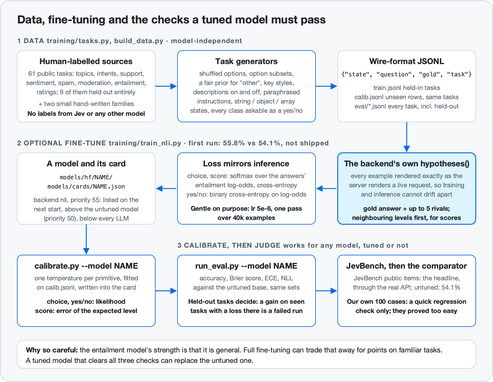

# Training, calibration and evaluation

local-jev's built-in models work **zero-shot**: nothing in this document is needed to run the server. This document covers what the project does around those models:

1. a **data pipeline** that turns public, human-labelled datasets into System One questions;
2. an optional **fine-tune of the entailment backend** on that data;
3. **calibration**, which is how every built-in model got the temperatures in its card;
4. the **evaluation** method, including the **independent benchmark** every built-in model has been measured on;
5. what is **deliberately not done**.



For how the models are served, see [architecture.md](architecture.md). The data pipeline was built for an earlier, much smaller model that the project has since dropped; that story is in [history.md](history.md). The data outlived it because it never depended on it.

## Contents

1. [Data](#data)
2. [Surface-form augmentation](#surface-form-augmentation)
3. [Fine-tuning the entailment backend](#fine-tuning-the-entailment-backend)
4. [Calibration](#calibration)
5. [Evaluation](#evaluation)
6. [Independent benchmark](#independent-benchmark)
7. [Reproducing](#reproducing)
8. [What is deliberately not done](#what-is-deliberately-not-done)
9. [Where the numbers are](#where-the-numbers-are)

## Data

`training/tasks.py`, `training/build_data.py`

All labels are **human annotations from public datasets**, loaded from the Hugging Face Hub. No label comes from a language model, and none comes from Jev ([why](#what-is-deliberately-not-done)).

There are **61 public task definitions**: 52 are trained on and 9 are held out entirely.

| Family | Tasks (held-out in *italics*) | Primitives exercised |
|---|---|---|
| Topic and category | dbpedia, newsgroups, bbc_news, fin_topic, news_cat, student_q, trec, language_id, *ag_news* | choice, noul |
| Intent | massive_intent, massive_scenario, clinc (150 intents), *banking77* (77 intents) | choice (large option sets), noul |
| Customer support | bitext_intent, bitext_category, ticket_queue, ticket_type, ticket_priority | choice, noul, score |
| Emotion and sentiment | tweet_sentiment, tse_sentiment, imdb, sst2, amazon_polarity, customer_reviews, *emotion* | choice, noul |
| Ratings and scales | amazon_stars, sst5, formality, toxicity_level, tweet_sentiment_scale, tse_sentiment_scale, *yelp* | score |
| Spam, phishing, clickbait | enron_spam, *sms_spam*, *phishing*, *clickbait* | noul, two-option choice |
| Moderation and safety | hate_offensive, offensive, hate, toxic, ethos, forum_hate, insincere, jailbreak, prompt_injection | choice, noul |
| Linguistic properties | subjectivity, irony, cola, counterfactual, climate | noul |
| Entailment, paraphrase, QA | mnli, mnli_noul, snli_noul, scitail, qnli, qqp, mrpc, nli_support, stsb, *rte*, *boolq* | choice, noul, score, over structured states |

The pair tasks matter beyond their own content: they are the ones whose state is an object (`{"premise": ..., "hypothesis": ...}`) and whose instructions refer to fields by name (`` The `claim` is supported by the `passage`. ``), which is how Jev's documentation recommends writing questions.

`build_data.py --per-task N --eval-per-task 300 [--seed S]` writes:

| File | Contents |
|---|---|
| `data/train.jsonl` | training examples from the 52 held-in tasks plus the hand-written families; `--per-task 1600` gives on the order of 80,000 |
| `data/calib.jsonl` | unseen rows from held-in tasks; used for validation during training and for fitting temperatures |
| `data/eval/<task>.jsonl` | up to 300 unseen rows per task, for all 61 tasks |

`--seed` changes which source rows are drawn for training, so a second build adds new examples rather than repeating the first. Train and eval rows come from the dataset's own train and test (or validation) splits. Where a dataset publishes a single split, a deterministic slice is carved off for evaluation before anything is sampled for training. Source texts longer than 1,400 characters keep their head and tail.

### Hand-written task families

Public datasets cover spam, sentiment and topics, but not the everyday triage questions people actually ask of a pile of text: *does this need a reply, how urgent is it, is this a bill, is this comment a question*. On those, a model trained only on public tasks was unsure, and on some it was confidently wrong: asked "Is the commenter asking a question?", it scored a literal question at 3%. Two small families fill that gap:

| Family | Source | Size | Questions generated from each item |
|---|---|---|---|
| `training/email_triage.py` | 78 emails written for this project | 16 to 40 examples per email | yes/no (billing, sponsorship, scam, needs a reply, automated, personal, urgent), category (10 kinds of mail, subsets, optional "Other"), urgency score on 3- and 5-level scales |
| `training/comment_triage.py` | 58 comments written for this project | same | yes/no (spam, question, deserves a reply, reports a problem, abusive, positive, suggestion), category (7 kinds), sentiment score |

They are labelled by construction (each item carries its attributes, and questions are generated from them), they go through the same augmentation as everything else, and **none of their text appears in any sample project**, so the seeded *Processing email* project remains a fair demonstration. They are a small share of the mix by design: about 2% of the examples in a full build (`build_data.py --email-per-email N` controls it; 0 leaves them out). The point is breadth of question types, not teaching the model these particular emails.

### A prior worth checking: how often is "other" the right answer?

The first data build made an `other` / `none of the above` option correct 62% of the time it appeared (it was added whenever the true class had been removed, and only occasionally as a distractor). The model being trained at the time duly learned to pick "Other" whenever it saw one: on the sample inbox, 45 of 48 emails came back as "Other". The generator now removes the true class 8% of the time and adds "other" as a distractor 30% of the time, which makes it correct about as often as any other option. After retraining on the corrected data the same question returned a sensible spread (Billing 8, Security 8, Notification 7, Opportunity 7, Other 9, ...), and all eight emails filed under Billing were billing mail. Any closed-set generator has priors like this; count them before training.

## Surface-form augmentation

Each source row becomes a question through a generator that varies everything except the truth. The aim is that the only stable signal across examples is *the meaning of the descriptions*.

| Variation | Detail |
|---|---|
| Option order | Always shuffled. No position carries information. |
| Option subsets | Large label sets are sampled down (mostly 4 to 26 options, sometimes 30 to 60); small sets are sometimes reduced too. |
| `other` options | When a subset of the classes is offered, the true class is left out 8% of the time and an `other` option (named `other`, `none_of_the_above`, `unknown`, ...) is then the right answer; independently, `other` is added as a wrong distractor 30% of the time. Together these make `other` correct about as often as any other option ([why](#a-prior-worth-checking-how-often-is-other-the-right-answer)). |
| Key style | `snake_case`, `lower case`, `Title Case` or `kebab-case`, **one style per question**, as a real user would write. |
| Descriptions | Present about 65% of the time where a task defines them, otherwise the option is its name alone, which Jev's API also allows. |
| Instructions | Several paraphrases per task; omitted entirely about 8% of the time for choices. |
| State shape | The same content as a bare string (60%), wrapped in a named field such as `{"message": ...}` (35%), or as a one-element array (5%). States that are already objects keep their field names, because instructions may refer to them. |
| Class as yes/no | About 35% of classification rows are asked as a noul instead ("This post is about {class}"), half with the true class and half with a wrong one, sometimes with a `criteria.true` description. |
| Binary tasks both ways | Asked as a noul 75% of the time (statement or question form, with or without true/false criteria) and as a two-option choice 25% of the time. |
| Score scales | Each rating task has several alternative wordings of its levels. |

Every example is stored in Jev's wire format, `{"state", "question", "gold", "task"}`, with the *index* of the correct answer rather than its text. Nothing about any model is baked into the data: each trainer or evaluator renders the examples through the backend it is working with, so the same files served three prompt designs of an earlier model ([history.md](history.md)) and now serve the entailment trainer unchanged.

## Fine-tuning the entailment backend

`training/train_nli.py`

**Status: one full run has been evaluated ([results](#results-so-far)).** It generalised to held-out public tasks (73.9% to 82.5%) but not to JevBench (54.1% to 55.8%, within noise), so it is not shipped. The design below is unchanged.

### Why try, and why be careful

The untuned entailment model is the smallest and fastest model here (0.87 GB, 76 ms median on JevBench), and the weakest judge: 54.1% on JevBench's public items, against 58.9% to 80.5% for the built-in LLMs. It does well on clear-cut classification (45 of 48 easy items) and poorly on policy application and multi-step judgments (41 of 72 standard, 39 of 111 hard). On this project's public validation rows it measures roughly 0.72 to 0.74 on choices, 0.70 to 0.76 on yes/no and 0.33 to 0.50 on scores (samples of 200 to 1,200 rows).

A fine-tune could make the small, fast option more useful. Expectations should be modest: another team's DeBERTa fine-tune scores 52.4% on the same JevBench items, slightly below this untuned model.

The risk is that full fine-tuning erodes the zero-shot generality the model does have. A model that gains ten points on the tasks it was trained on and loses five on a user's own categories is a worse product. So the defaults are gentle, and the result has to earn its place on held-out tasks and on JevBench before it is adopted.

### Design

- **Same data, same rendering as inference.** Examples are the wire-format JSONL described above. Each is rendered through the backend's own `hypotheses()`, the function the server calls for a live request, so training and inference cannot drift apart.
- **The loss mirrors how the backend turns model outputs into answers.**

  | Primitive | At inference | Training loss |
  |---|---|---|
  | choice, score | softmax over the answers' entailment log-odds | the same softmax, cross-entropy against the correct answer, over the gold option plus **up to 5 sampled rivals** (`--max-options 6`) |
  | yes/no | sigmoid of one hypothesis's log-odds | binary cross-entropy on those log-odds |

  For scores, rivals are not sampled uniformly: **neighbouring levels are preferred**, because telling level 3 from level 4 is the distinction that is hard and the one that matters.
- **Gentle defaults.** Learning rate 5e-6, one pass over 40,000 examples (`--examples`, `--epochs 1`), AdamW with weight decay 0.01, 5% warm-up then cosine decay, gradient clipping at 1.0, sequences capped at 384 tokens, about 32 (premise, hypothesis) pairs per step (`--pair-budget`; lower it if memory runs out). On CUDA it trains under bf16 autocast; otherwise it uses Apple MPS or the CPU.
- **Validation split by primitive.** Every `--eval-every` steps, and once before the first step for the untuned baseline, it reports loss and accuracy on held-back rows separately for choice, score and yes/no. An aggregate number mixes two-way and many-way questions and can hide a primitive that is getting worse.
- **What it writes.** A Hugging Face model directory under `models/hf/<name>/`, saved at every evaluation point so a run can be stopped early, and a card at `models/cards/<name>.json` with `backend: "nli"`, `priority: 55`, `batch_size: 32` and `hf_model` pointing at that directory. The server lists the model on its next start. Priority 55 ranks it above the untuned entailment model (50) and below every LLM, because the first run did not beat them; raise it by hand if your run does.

For NVIDIA hardware, see [training/README-gpu.md](../training/README-gpu.md).

### How to judge a run

1. **Held-out tasks.** `evals/run_eval.py --model <name>` against the same command for `nli-deberta-large`. The nine held-out tasks say whether generality survived. A gain on held-in tasks with a loss on held-out tasks is a failed run.
2. **Recalibrate.** Fine-tuning changes how confident the model is. Run `training/calibrate.py --model <name>` before comparing confidence, ECE or "accuracy when sure".
3. **JevBench's public items**, the [independent benchmark](#independent-benchmark). This is the number that decides: the untuned model scores 54.1% there. JevBench's items were never added to this project's training data.
4. **The comparator and the sample inbox**, as regression checks: `evals/compare/run_compare.py --systems nli-deberta-large <name>`, and the sample project, where the untuned model over-triggers some yes/no questions on messy mail.

### Results so far

<!-- NLI-RESULTS:BEGIN -->
**`nli-deberta-large-ft1`** (September 2026): 40,000 examples, one epoch, learning rate 5e-6, on an RTX 3090 Ti (3,399 steps, about 4 hours). Training was stable: validation loss fell from 1.02 to 0.37 and never rose.

| | Untuned | Fine-tuned |
|---|---|---|
| Validation (same distribution as training): choice / yes-no / score | 71.8% / 69.6% / 49.6% | 89.7% / 86.9% / 73.2% |
| 9 held-out tasks, never trained on (macro accuracy) | 73.9% | **82.5%** |
| held-out yes/no · category · score | 71.9% · 78.6% · 43.0% | 86.3% · 81.8% · 63.0% |
| held-out calibration error (ECE, macro) | 0.163 | 0.103 |
| **JevBench public, 231 items** | **54.1%** | **55.8%** |
| JevBench easy / standard / hard | 93.8% / 56.9% / 35.1% | 97.9% / 65.3% / 31.5% |
| JevBench median latency | 76 ms | 62 ms |

**What it means.** The fine-tune generalises to new tasks of the kind it was trained on: public, human-labelled classification datasets it never saw (phishing 64.9% → 93.2%, rte 63.0% → 92.0%, yelp stars 43.0% → 63.0%). It does not transfer to JevBench, the independent benchmark: 23 items fixed and 19 broken, a net gain of 4 of 231, within noise, and worse on the hard tier. JevBench's decisions are judgement calls over realistic business text rather than dataset labels, and more examples of the latter do not teach the former. The Qwen3.5 models, which were not fine-tuned at all, remain far ahead (2B 66.2%, 4B 80.5%).

The weights are not published and no built-in card ships for this model. Anyone who trains it gets a card in `models/cards/` with priority 55, so it never becomes the default over the Qwen models.
<!-- NLI-RESULTS:END -->

## Calibration

`training/calibrate.py --model <name> [--kinds choice score noul] [--n 2500]`

Every built-in model's card carries one temperature per primitive, fitted with this script on held-back rows of `data/calib.jsonl`. It scores the rows with the named model on whatever backend that is, grid-searches a temperature per primitive, and writes `models/cards/<name>.json`, a user card that overrides the built-in one. `--kinds` refits only the named primitives and keeps the card's other temperatures.

| Primitive | Objective |
|---|---|
| choice, yes/no | minimise negative log-likelihood |
| score | minimise the **error of the expected level**, with the temperature floored at 1 |

Scores are treated differently because a score's headline output is the expected level, not the distribution. Fitting scores on likelihood gave the 4B LLM a temperature of 9.6: its probabilities became honest on noisy labels, and every expected level was dragged toward the middle of the scale, which cost 12 points of score accuracy on the comparison set. The fitted values, and why LLMs need such large yes/no temperatures, are in [architecture.md](architecture.md#5-calibration).

Temperature scaling cannot change which answer wins, only how much probability it gets. An ensemble has no temperatures of its own; it pools its members' calibrated probabilities.

## Evaluation

`evals/run_eval.py --model <name> [--n 300] [--tasks ...]`, `evals/metrics.py`, `evals/report_md.py`

`run_eval.py` runs every set under `data/eval/` for any model in the registry, on any backend, and writes a JSON report to `evals/reports/` with per-task numbers, pooled numbers per primitive and split, a macro average over tasks, and reliability bins. `report_md.py` renders one or two reports as Markdown tables.

| Metric | What it tells you |
|---|---|
| Accuracy | Is the top answer right. For scores, the rounded expected level against the true level, plus mean absolute error in levels. |
| Negative log-likelihood | How much probability the right answer received. |
| Brier score | Squared error of the probabilities; rewards being right *and* appropriately sure. |
| Expected calibration error (ECE) | Bin answers by stated confidence and compare with the fraction actually correct. Low ECE is what makes a confidence threshold trustworthy. |

**Two kinds of held-out.** Results are reported separately for:

- **held-in tasks, unseen rows**: for a fine-tuned model, did training work at all;
- **held-out tasks** (*ag_news, banking77, emotion, sms_spam, phishing, clickbait, rte, boolq, yelp*): can the model judge from descriptions on a kind of task it never trained on. These nine cover all three primitives, a large option set (banking77), structured states (rte, boolq), and email (phishing, sms_spam).

For the zero-shot built-in models the distinction does not apply: this project never trained them, so every task is unseen by *this project's* training. Their authors' training data is another matter: several of these public datasets are common in NLI and instruction-tuning mixtures, so treat public-benchmark numbers for any pretrained model as an upper bound, and prefer the hand-written comparator cases and your own data.

Always compare a tuned model against its untuned base on the same sets. If held-out accuracy lags far behind held-in accuracy, the remedy is more varied tasks, not more epochs.

`run_eval.py` is the tool for calibration and for judging a fine-tune. It is not the headline number for a model: the public datasets are familiar to pretrained models, and this project's own splits say nothing about the kinds of question other people ask. The headline is the [independent benchmark](#independent-benchmark) below.

The **comparator** (`evals/compare/`) is the third tool: 100 hand-written cases, every system called with identical requests, one HTML report. Treat it as a quick regression check and a way to read answers side by side, not as a score: it proved far too easy (below). It is described in [architecture.md](architecture.md#9-evaluation-and-benchmarks).

## Independent benchmark

[JevBench](https://github.com/fstandhartinger/jevbench) (Benchmark Heaven, MIT) is an independent benchmark for Jev-class systems. Its harness has a `typesafe` adapter that speaks Jev's `/v1/systemone`, so local-jev is measured through exactly the API a client uses, one decision per request. Only its **231 public items** have been run (48 easy, 72 standard, 111 hard); the other 303 are held out by the benchmark and were not run. None of its items has ever been used for training or calibration here.

**Why this is the number we lead with.** This project's own 100 hand-written cases were far too easy, and they misled us. The entailment model scored 95% on them and 54.1% on JevBench. An ensemble of the entailment model and Qwen3-4B scored 98% on them, the best local result, and 68.8% on JevBench, below Qwen3-4B alone (70.1%); its built-in card was removed. Cases you write yourself tend to be the cases you already know how to answer.

### Running it

```sh
# 1. The benchmark and its public items
git clone https://github.com/fstandhartinger/jevbench && cd jevbench
#    (install the harness as its README describes)
cat datasets/public/{easy,original,hard}.jsonl > public.jsonl

# 2. With local-jev serving on its default port (local-jev serve), one run per model
python -m jevbench.cli run --tasks public.jsonl --adapter typesafe \
    --endpoint http://127.0.0.1:8765 --key-env '' --model llm-qwen3.5-4b \
    --results runs/llm-qwen3.5-4b.jsonl \
    --cap-usd 100000 --price-in-per-m 0 --price-out-per-m 0

# 3. Back in local-jev: summarise the runs and write them into the model cards
python evals/jevbench_cards.py --runs <path to jevbench>/runs --tasks <path to jevbench>/public.jsonl
```

- `--model` becomes the request's `model` field, so it selects which local model answers; the server's own default does not matter. `--key-env ''` sends no key, which local-jev accepts unless `LOCAL_JEV_API_KEY` is set.
- **Override the cost settings.** The harness estimates what each request costs from its token counts at a default hosted-API price, and stops the run when the estimate reaches its default cap of $15. A local model costs nothing, but a long run of a slow model would hit the cap and stop early. Setting both prices to 0 and the cap high lets the run finish.
- Run one model at a time. local-jev serialises model work anyway, and a clean run gives clean latencies.
- Name each result file after the model; `jevbench_cards.py` reads one `<model>.jsonl` per model from `--runs`.

`evals/jevbench_cards.py` computes accuracy (the share of the 231 decisions whose top answer is correct; failed requests count as wrong), accuracy per tier, and the median and 95th-percentile latency the harness measured around each HTTP request. It writes them into each model's card as `evaluation`, with the hardware, the date and Jev's published result on the same items (86.6%) as a reference. Built-in cards are updated in place; any other model gets an override in `models/cards/`. The UI's model picker and Models page, and the comparator report, read the numbers from there.

### What it measures, and what it does not

- **Accuracy of the top answer only.** Temperature scaling never changes which answer wins, so calibration does not move these numbers. Whether a stated confidence can be trusted is measured by `run_eval.py` (ECE, Brier) and by the comparator's "accuracy when sure". JevBench's own composite score also has calibration, speed and cost axes; local-jev reports accuracy and latency only.
- **The public items, on one machine.** The results are for an Apple M4 Max with PyTorch on the Mac GPU. The held-out items were not run.
- **The prompt layouts were chosen on these items.** Each Qwen card's `prompt` setting was picked by measuring both layouts on the same 231 public items (Qwen3.5-4B: 73.2% plain, 80.5% JSON), so those cards' results are mildly optimistic. The same was true of the ensemble on the hand-written cases, which is exactly how that result misled.

## Reproducing

```sh
# 1. Build the datasets (downloads the public sources on first run)
.venv/bin/python training/build_data.py --per-task 1600 --eval-per-task 300

# 2. Evaluate a built-in model on the public sets
.venv/bin/python evals/run_eval.py --model nli-deberta-large

# 3. Refit a model's temperatures (writes models/cards/<name>.json)
.venv/bin/python training/calibrate.py --model nli-deberta-large

# 4. Measure a model on JevBench's public items: see "Independent benchmark" above

# 5. Optional: fine-tune the entailment model, then calibrate, evaluate and compare it
.venv/bin/python training/train_nli.py --data data/train.jsonl --val data/calib.jsonl --out models/hf/nli-deberta-large-ft1
.venv/bin/python training/calibrate.py --model nli-deberta-large-ft1
.venv/bin/python evals/run_eval.py --model nli-deberta-large-ft1
.venv/bin/local-jev serve &
.venv/bin/python evals/compare/run_compare.py --systems nli-deberta-large nli-deberta-large-ft1
```

Data generation is seeded, so the same command produces the same examples. `build_data.py --only <task> ...` rebuilds the evaluation files of selected tasks, `--email-per-email N` sets how many examples each hand-written email or comment contributes (0 leaves those families out), and `--seed` draws different training rows.

## What is deliberately not done

**Jev is not the teacher.** The obvious way to build a Jev-like model is to label data with Jev and train on its outputs. TypeSafe's Master Customer Agreement, section 2.3(b), prohibits using the service or any output "to perform model distillation, train a model to imitate the output of the Services, or develop (or to facilitate the development of) a similar or competing product or service." This project does none of those things:

- no training label or soft target comes from Jev;
- Jev is not the calibration target, and no number in this document's results was produced with it;
- the optional [comparator](architecture.md#9-evaluation-and-benchmarks) can include the hosted API as one system in a side-by-side report on 100 hand-written cases. Those responses are cached for that report only (git-ignored), nothing under `training/` or `data/` reads them, and the cases themselves are never training data. It runs equally well with `jev` left out;
- Jev's JevBench result quoted in these documents is the benchmark's published number on the public items; local-jev did not call the hosted API to obtain it;
- the only thing taken from TypeSafe is the publicly documented request and response format.

**No synthetic labels from other language models either**, at least for now. Human gold labels are slower to broaden than LLM-generated ones, but their noise is honest annotator disagreement, which is what a calibrated model should reproduce. A local teacher model for broader task coverage is a possible later step and would be documented here.

## Where the numbers are

All measured results, with reproduction commands and caveats, are in **[results.md](results.md)**: JevBench for every built-in model, the hand-written comparator, the prompt-layout experiment and performance. Fine-tuning results are [above](#results-so-far). The two fine-tuned models the project built and then retired are in [history.md](history.md#what-two-fine-tuned-adapters-achieved).
